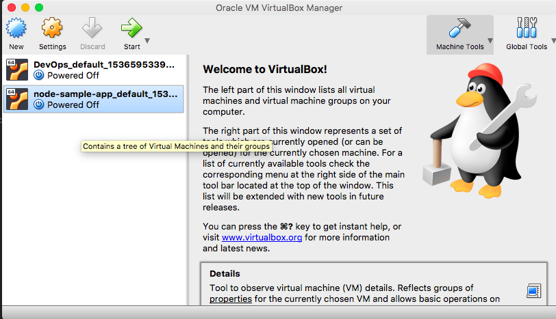
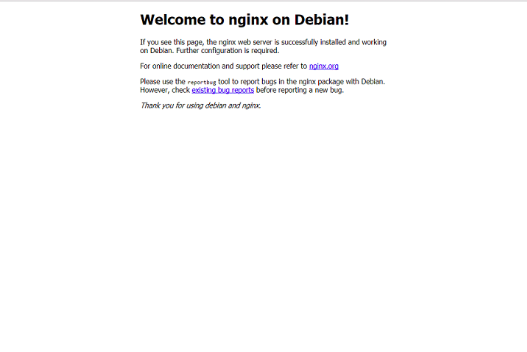

# Sparta Node Sample App

## Description

This app is intended for use with the Sparta Global Devops Stream as a sample app. You can clone the repo and use it as is but no changes will be accepted on this branch.

To use the repo within your course you should fork it.

The app is a node app with three pages.

### Homepage

``localhost:3000``

Displays a simple homepage displaying a Sparta logo and message. This page should return a 200 response.

### Blog

``localhost:3000/posts``

This page displays a logo and 100 randomly generated blog posts. The posts are generated during the seeding step.

This page and the seeding is only accessible when a database is available and the DB_HOST environment variable has been set with it's location.

### A fibonacci number generator

``localhost:3000/fibonacci/{index}``

This page has be implemented poorly on purpose to produce a slow running function. This can be used for performance testing and crash recovery testing.

The higher the fibonacci number requested the longer the request will take. A very large number can crash or block the process.


### Hackable code

``localhost:3000/hack/{code}``

There is a commented route that opens a serious security vulnerability. This should only be enabled when looking at user security and then disabled immediately afterwards

## Usage

Clone the app

```
npm install
npm start
```

You can then access the app on port 3000 at one of the urls given above.

## Tests

There is a basic test framework available that uses the Mocha/Chai framework

```
npm test
```

The test for posts will fail ( as expected ) if the database has not been correctly setup.

## Virtual Machine set up

- Download Hashcorp Vagrant [Here](www.vagrantup.com)
- Download Oracle VirtualBox [Here](www.virtualbox.org)
- Install both onto your system.
- Go into the console and cd into your repo
``` bash
cd <your repo name>
```
- Verify that vagrant is installed. Repeat steps if required.
``` bash
vagrant version
```
- Open VirtualBox to ensure your VM will be running
- In your repo, initialise Vagrant
``` bash
vagrant init
```
- Once completed, a file called Vagrantfile should now be within your repo.
- You now want to install the hostsupdater plugin
``` bash
vagrant plugin install hostsupdater
```
- Once complete, open your Vagrantfile in a text editor.
- Remove all of the contents and input the following:
``` ruby
# Version of vagrant you would like to use
Vagrant.configure("2") do |config|
  # What OS you would like your VM to be. Example below
  config.vm.box = "ubuntu/xenial64"
  # The network you want your VM to use
  config.vm.network("private_network", ip: "<Your IP address>")
  # The alias you would like to give that network
  config.hostsupdater.aliases("development.local")
end
```
- Now run vagrant
``` bash
vagrant up
```
- This will now install the OS and run the Virtual Machine (VM), you should see this in virtual box:


- Go back to the console and connect with your VM
``` bash
vagrant ssh
```
- You should see this or something like this:    


- Now run an update on all the packages within your VM. An example for Ubuntu is shown below.
``` bash
sudo apt-get update
```
- Now install nginx on your VM
``` bash
sudo apt-get install nginx -y
```
- You can now go to your browser and type in the name of your IP alias. You should see this:



- Your virtual machine is ready!

# Testing Jenkins

This is a test for jenkins.
